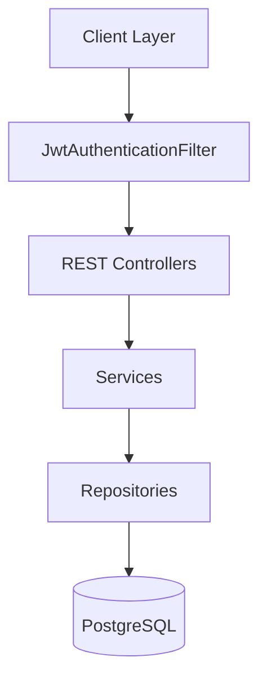
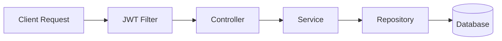
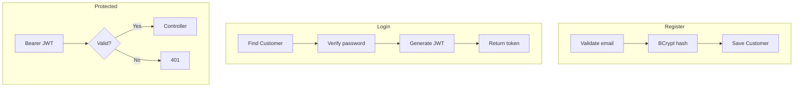
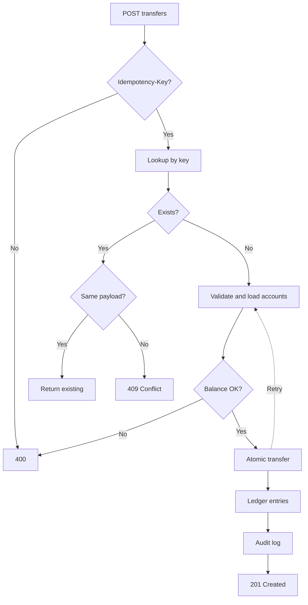
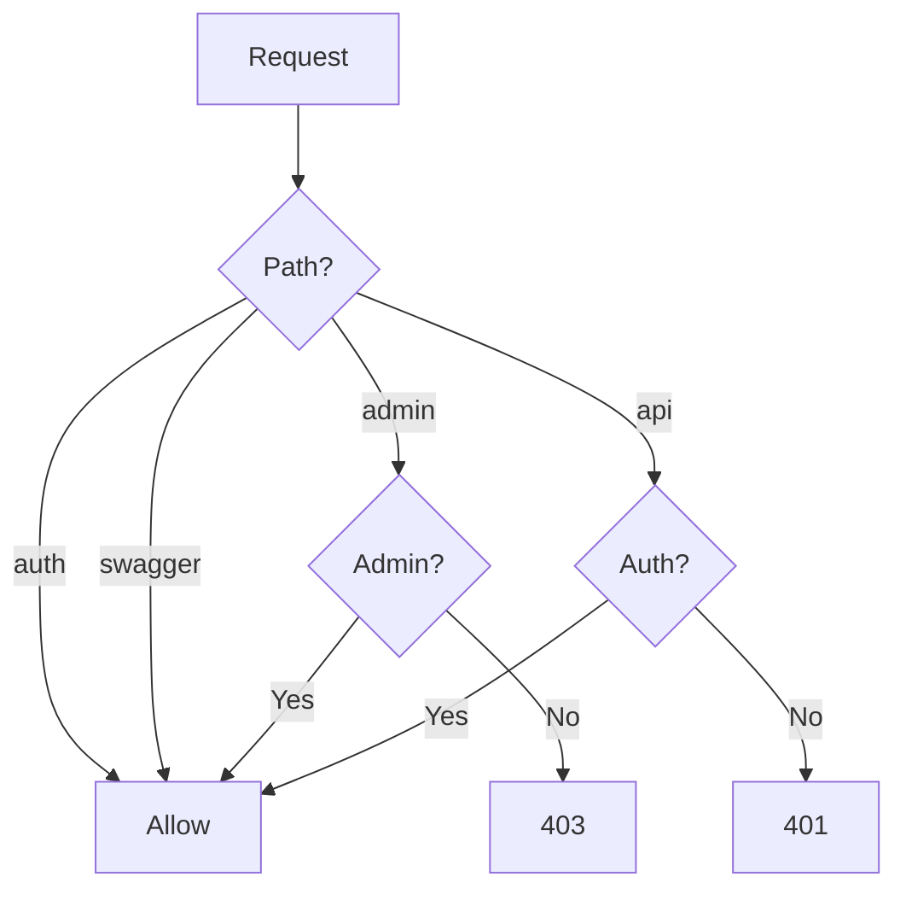
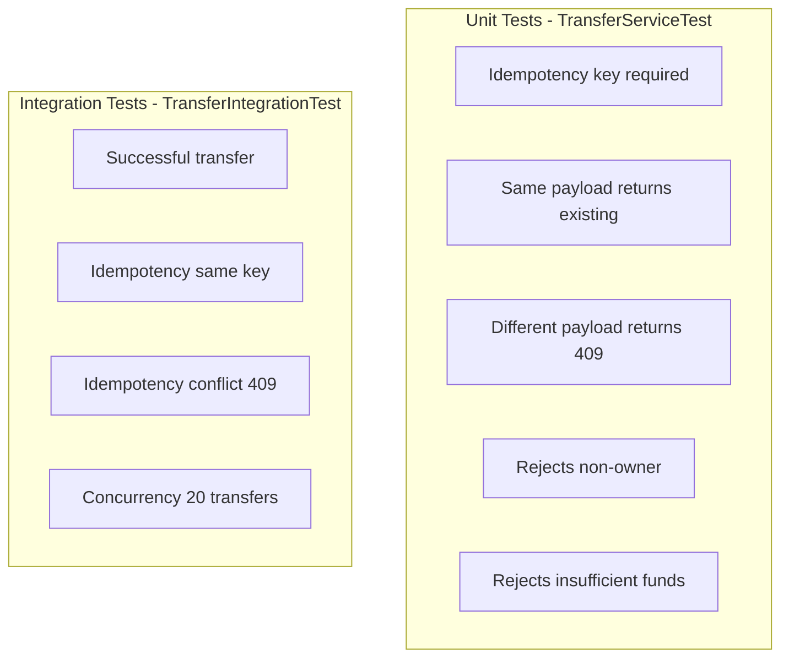

# Mini Core Banking System

A portfolio-grade Spring Boot 4 (Java 21) REST API implementing a mini core banking system with JWT authentication, accounts, deposits, withdrawals, transfers, transaction ledger, and audit logging. Built with production-ready patterns: idempotency, optimistic locking, and full audit trails.

---

## Table of Contents

- [Tech Stack](#tech-stack)
- [Architecture Overview](#architecture-overview)
- [Request Flow](#request-flow)
- [Authentication Flow](#authentication-flow)
- [Transfer Flow (Core Business Logic)](#transfer-flow-core-business-logic)
- [Data Model](#data-model)
- [Security Model](#security-model)
- [Key Design Decisions](#key-design-decisions)
- [API Endpoints](#api-endpoints)
- [Configuration](#configuration)
- [Running the Application](#running-the-application)
- [Testing](#testing)
- [Project Structure](#project-structure)
- [Error Handling](#error-handling)

---

## Tech Stack

| Layer | Technology |
|-------|------------|
| **Runtime** | Java 21 |
| **Framework** | Spring Boot 4 |
| **Web** | Spring Web MVC |
| **Security** | Spring Security + JWT (JJWT 0.12.5) |
| **Persistence** | Spring Data JPA, PostgreSQL |
| **Migrations** | Flyway |
| **Validation** | Jakarta Bean Validation |
| **API Docs** | SpringDoc OpenAPI 3 (Swagger UI) |
| **Testing** | JUnit 5, MockMvc, Testcontainers (PostgreSQL 16) |
| **Build** | Maven 3.9+ |

---

## Architecture Overview

The system follows a layered architecture with clear separation of concerns:



---

## Request Flow

How an authenticated request flows through the system:



---

## Authentication Flow



**JWT claims:** `sub` (email), `userId`, `role`, `exp` (expiration). Stateless; no server-side session.

---

## Transfer Flow (Core Business Logic)

The transfer operation is the most complex, demonstrating idempotency, optimistic locking, and audit logging:



**Key behaviors:**
- **Idempotency:** Same key + same payload → returns original result; same key + different payload → 409 Conflict.
- **Optimistic locking:** `Account.version`; on concurrent update, retry up to 3 times.
- **Atomicity:** Balance updates, ledger entries, and transfer record committed in a single transaction.

---

## Data Model

Entity relationships and key fields:

```mermaid
erDiagram
    CUSTOMER ||--o{ ACCOUNT : owns
    CUSTOMER ||--o{ AUDIT_LOG : performs
    ACCOUNT ||--o{ LEDGER_ENTRY : has
    ACCOUNT ||--o{ TRANSFER : from
    ACCOUNT ||--o{ TRANSFER : to
    CUSTOMER {
        bigint id PK
        varchar email UK
        varchar password_hash
        varchar role
    }
    ACCOUNT {
        bigint id PK
        bigint customer_id FK
        varchar iban UK
        decimal balance
        bigint version
    }
    LEDGER_ENTRY {
        bigint id PK
        bigint account_id FK
        varchar type
        decimal amount
    }
    TRANSFER {
        bigint id PK
        bigint from_account_id FK
        bigint to_account_id FK
        varchar idempotency_key UK
    }
    AUDIT_LOG {
        bigint id PK
        bigint actor_id FK
        varchar action
    }
```

| Entity | Purpose |
|--------|---------|
| **Customer** | User identity; email, BCrypt password hash, role (USER/ADMIN) |
| **Account** | Bank account; IBAN, currency, balance; `version` for optimistic locking |
| **LedgerEntry** | Immutable transaction record; double-entry style (TRANSFER_IN/OUT) |
| **Transfer** | Transfer record; `idempotency_key` prevents duplicate execution |
| **AuditLog** | Compliance trail for all money-moving operations |

---

## Security Model



- **Stateless:** No server-side sessions; JWT carries identity.
- **CSRF disabled:** Appropriate for token-based API.
- **Admin role:** Granted via DB (`UPDATE customer SET role = 'ADMIN'`).

---

## Key Design Decisions

| Decision | Rationale |
|----------|-----------|
| **Correctness over features** | Never allow negative balance; strict validation on amount, currency, ownership |
| **`@Transactional`** | All money-moving operations atomic; rollback on any exception |
| **Optimistic locking** | `Account.version`; handles concurrent transfers without pessimistic locks on read |
| **Idempotency** | `Idempotency-Key` header prevents double transfers on retries |
| **BigDecimal** | Monetary amounts with scale 2; no floating-point errors |
| **Audit log** | All money operations recorded for compliance |
| **Flyway** | Versioned, repeatable schema migrations |

---

## API Endpoints

| Method | Path | Auth | Description |
|--------|------|------|-------------|
| POST | `/api/auth/register` | No | Register customer |
| POST | `/api/auth/login` | No | Login; returns JWT |
| POST | `/api/accounts` | Yes | Create account (currency) |
| GET | `/api/accounts` | Yes | List own accounts |
| GET | `/api/accounts/{id}` | Yes | Get account details |
| POST | `/api/accounts/{id}/deposit` | Yes | Deposit |
| POST | `/api/accounts/{id}/withdraw` | Yes | Withdraw |
| POST | `/api/transfers` | Yes | Transfer (requires `Idempotency-Key`) |
| GET | `/api/accounts/{id}/ledger` | Yes | Paginated ledger entries |
| GET | `/api/admin/audit` | Admin | List audit logs |

---

## Configuration

| Profile | When Active | Purpose |
|---------|-------------|---------|
| `dev` | Default (`mvn spring-boot:run`) | Local PostgreSQL (port 5435), DEBUG logging, SQL logging |
| `test` | `mvn test` | Testcontainers PostgreSQL, test JWT secret |

---

## Running the Application

### Prerequisites

- Java 21
- Maven 3.9+
- Docker & Docker Compose (for PostgreSQL)

### Steps

**1. Start PostgreSQL**

```bash
docker compose up -d
```

**2. Run the application**

```bash
mvn spring-boot:run
```

- API: `http://localhost:8080`
- Swagger UI: `http://localhost:8080/swagger-ui.html`

**3. (Optional) Production JWT secret**

```bash
export JWT_SECRET="your-64-char-secret-at-least-for-hs256-algorithm-xxxxxxxxx"
mvn spring-boot:run
```

---

## Sample cURL Commands

### Register

```bash
curl -X POST http://localhost:8080/api/auth/register \
  -H "Content-Type: application/json" \
  -d '{"email":"user@example.com","password":"password123"}'
```

### Login

```bash
TOKEN=$(curl -s -X POST http://localhost:8080/api/auth/login \
  -H "Content-Type: application/json" \
  -d '{"email":"user@example.com","password":"password123"}' \
  | jq -r '.accessToken')
echo $TOKEN
```

### Create account

```bash
curl -X POST http://localhost:8080/api/accounts \
  -H "Authorization: Bearer $TOKEN" \
  -H "Content-Type: application/json" \
  -d '{"currency":"SEK"}'
```

### Deposit

```bash
curl -X POST http://localhost:8080/api/accounts/1/deposit \
  -H "Authorization: Bearer $TOKEN" \
  -H "Content-Type: application/json" \
  -d '{"amount":1000.00,"currency":"SEK","reference":"Initial deposit"}'
```

### Withdraw

```bash
curl -X POST http://localhost:8080/api/accounts/1/withdraw \
  -H "Authorization: Bearer $TOKEN" \
  -H "Content-Type: application/json" \
  -d '{"amount":100.00,"currency":"SEK","reference":"ATM withdrawal"}'
```

### Transfer (with Idempotency-Key)

```bash
curl -X POST http://localhost:8080/api/transfers \
  -H "Authorization: Bearer $TOKEN" \
  -H "Content-Type: application/json" \
  -H "Idempotency-Key: $(uuidgen)" \
  -d '{"fromAccountId":1,"toAccountId":2,"amount":50.00,"currency":"SEK","reference":"Payment"}'
```

### Ledger (paginated)

```bash
curl -X GET "http://localhost:8080/api/accounts/1/ledger?page=0&size=20" \
  -H "Authorization: Bearer $TOKEN"
```

With date range:

```bash
curl -X GET "http://localhost:8080/api/accounts/1/ledger?from=2025-01-01T00:00:00Z&to=2025-12-31T23:59:59Z&page=0&size=20" \
  -H "Authorization: Bearer $TOKEN"
```

### Admin audit (requires ADMIN role)

```bash
# First create an admin user: register normally, then update role in DB:
# UPDATE customer SET role = 'ADMIN' WHERE email = 'admin@example.com';

curl -X GET "http://localhost:8080/api/admin/audit?page=0&size=20" \
  -H "Authorization: Bearer $ADMIN_TOKEN"
```

---

## Testing



### Run tests

```bash
# All tests (unit + integration)
mvn test

# Unit tests only
mvn test -Dtest=*Test

# Integration tests only (requires Docker for Testcontainers)
mvn test -Dtest=*IntegrationTest
```

Integration tests use **Testcontainers** with PostgreSQL 16. Ensure Docker is running.

---

## Project Structure

```
src/main/java/com/shotaroi/bank/
├── BankApplication.java
├── config/
│   ├── JwtProperties.java
│   └── OpenApiConfig.java
├── security/
│   ├── AuthenticatedUser.java
│   ├── JwtAuthenticationFilter.java
│   ├── JwtTokenProvider.java
│   └── SecurityConfig.java
├── customer/
│   ├── Customer.java
│   ├── CustomerController.java
│   ├── CustomerRepository.java
│   ├── CustomerService.java
│   └── dto/
├── account/
│   ├── Account.java
│   ├── AccountController.java
│   ├── AccountRepository.java
│   ├── AccountService.java
│   ├── IbanGenerator.java
│   └── dto/
├── ledger/
│   ├── LedgerEntry.java
│   ├── LedgerController.java
│   ├── LedgerRepository.java
│   ├── LedgerService.java
│   └── dto/
├── transfer/
│   ├── Transfer.java
│   ├── TransferController.java
│   ├── TransferRepository.java
│   ├── TransferService.java
│   └── dto/
├── audit/
│   ├── AuditLog.java
│   ├── AdminAuditController.java
│   ├── AuditLogRepository.java
│   ├── AuditService.java
│   └── dto/
└── common/
    ├── dto/
    │   └── ApiError.java
    └── exceptions/
        ├── GlobalExceptionHandler.java
        ├── IdempotencyConflictException.java
        ├── InsufficientFundsException.java
        └── ResourceNotFoundException.java

src/test/java/com/shotaroi/bank/
├── integration/
│   └── TransferIntegrationTest.java
└── unit/
    └── TransferServiceTest.java

src/main/resources/
├── application.yml
├── application-dev.yml
├── application-test.yml
└── db/migration/
    └── V1__init.sql
```

---

## Error Handling

All errors return consistent JSON via `GlobalExceptionHandler`:

```json
{
  "timestamp": "2025-02-11T12:00:00.000Z",
  "status": 400,
  "error": "Bad Request",
  "message": "Amount must be positive",
  "path": "/api/transfers"
}
```

| Exception | HTTP Status |
|-----------|-------------|
| `ResourceNotFoundException` | 404 |
| `InsufficientFundsException` | 400 |
| `IdempotencyConflictException` | 409 |
| `IllegalArgumentException` | 400 |
| `AccessDeniedException` | 403 |
| `ObjectOptimisticLockingFailureException` | 409 (Concurrent modification. Please retry.) |
| `MethodArgumentValidException` | 400 (validation errors) |

---

## License

MIT
